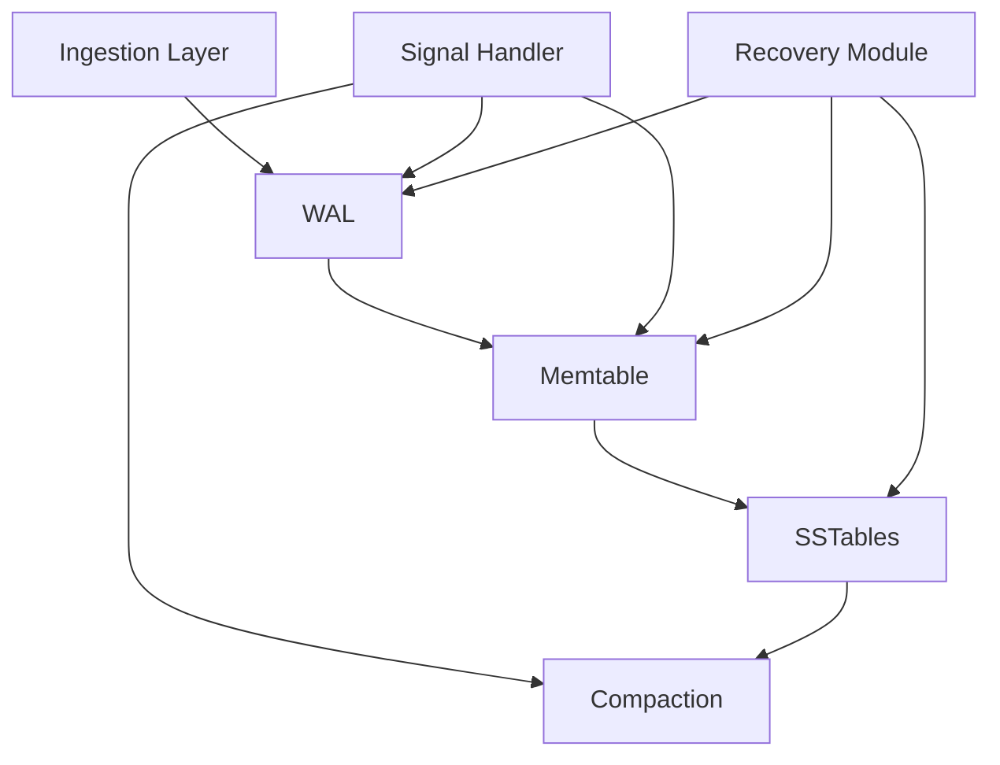
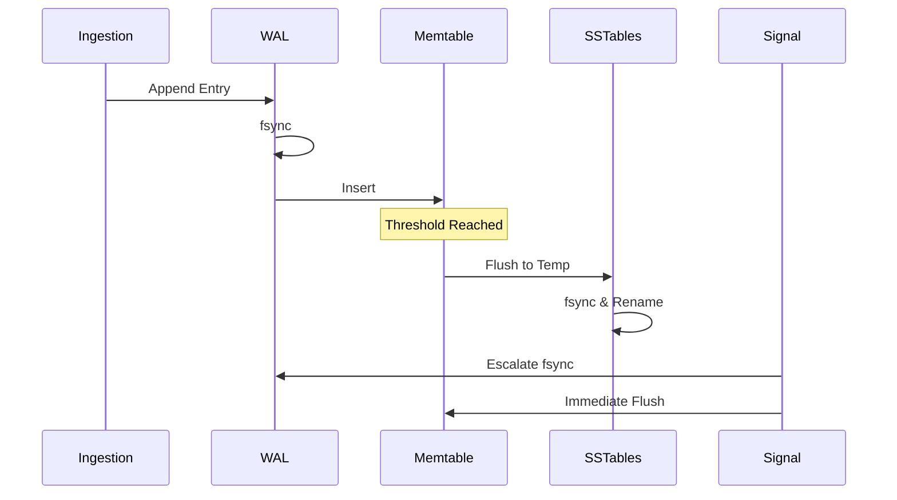
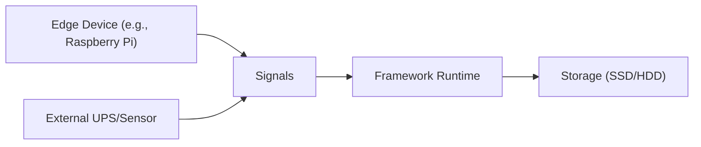

# Architectural Document for Resilient Log Persistence Framework

This document describes the high-level architecture of a power-aware log persistence framework for intermittent power environments. It captures key components, interactions, decisions, and rationale to guide potential implementation and ensure alignment with resilience goals.

## Overview

The framework is designed for edge devices in unstable grids (e.g., sub-Saharan Africa), prioritizing durability over throughput. It integrates WAL for immediate commits, LSM-trees for efficient storage, and signal handling for adaptive flushing. Key decisions: Single-writer model for simplicity (trade-off: scalability vs. correctness); Rust's memory safety guarantees for reliability.

## Components

### 1. Ingestion Layer

- **Description**: Handles log inputs from files, networks, or stdout.
- **Rationale**: Modular to support diverse sources in edge setups; uses queues for buffering. Trade-off: Adds minor latency but ensures decoupling from persistence.
- **Interactions**: Forwards to WAL; handles backpressure during signals.

### 2. Write-Ahead Log (WAL)

- **Description**: Append-only log with sequence numbers and checksums; fsync on commits.
- **Rationale**: Ensures durability; rotation at thresholds (e.g., 1GB) to bound recovery time. Alternative considered: In-memory WAL (rejected for power loss risks).
- **Interactions**: Precedes memtable inserts; replayed on startup.

### 3. Memtable

- **Description**: In-memory sorted structure (e.g., BTreeMap) for buffering.
- **Rationale**: O(log N) operations for efficiency; flushes at thresholds (e.g., memory limit). Trade-off: Memory use vs. flush frequency.
- **Interactions**: Merges with WAL on recovery; flushes to SSTables.

### 4. SSTables and Compaction

- **Description**: Immutable disk files from flushes; leveled compaction merges levels.
- **Rationale**: Optimizes reads/writes; paused during signals to prioritize flushes. Alternative: Tiered compaction (considered for future if read-heavy).
- **Interactions**: Queried for reads; manifest tracks active files.

### 5. Signal Handler

- **Description**: Listens for power signals (e.g., SIGUSR1); escalates fsyncs and flushes.
- **Rationale**: Treats instability as first-class; trade-off: Temporary throughput drop for durability. Rejected polling for efficiency.
- **Interactions**: Triggers WAL/memtable actions; integrates with OS signals.

### 6. Recovery Module

- **Description**: Replays WAL, discards partials, reports gaps.
- **Rationale**: Idempotent and observable; ensures no silent loss. Trade-off: Replay time vs. frequent checkpoints.
- **Interactions**: Initializes memtable/SSTables on startup.

## Architectural Views

### Logical View

This view shows the static structure of components and their relationships.

- **Rationale**: Illustrates data flow and control; single arrows indicate primary interactions.

### Process View

This view depicts runtime behavior, focusing on write and flush flows.

- **Rationale**: Highlights sequencing and signal interruptions; useful for understanding dynamic adaptations.

### Deployment View

This view outlines hardware and environment.

- **Rationale**: Emphasizes single-node setup; trade-off: Simplicity vs. distributed resilience.

## Design Decisions and Trade-Offs

- **Single-Writer**: Simplifies concurrency; trade-off: Limits scalability but ensures correctness in unstable environments. Alternative: Multi-threaded with locks (deferred for complexity).
- **Fsync Priority**: Guarantees durability; trade-off: Latency increase (ms per write). Alternative: Batch fsync (rejected for atomicity risks).
- **LSM over B-Trees**: Write-optimized; trade-off: Read amplification managed by compaction. Alternative: B-Trees (better reads but slower writes).
- **Signal Integration**: Adaptive resilience; trade-off: Requires external hardware for signals. Alternative: Periodic polling (less efficient).
- **Observability**: Logging of states (e.g., last fsync); rationale: Builds trust in recovery. Trade-off: Minor overhead for metrics.

## Assumptions and Constraints

- Assumptions: POSIX-compliant OS; access to signals; bounded input rates.
- Constraints: Memory-bounded (e.g., 128MB memtable); no distributed setup initially; focuses on append-only logs.

## Future Considerations

- Multi-writer extensions with locking.
- ML for predictive flushing.
- Integration with cloud backups for hybrid resilience.
